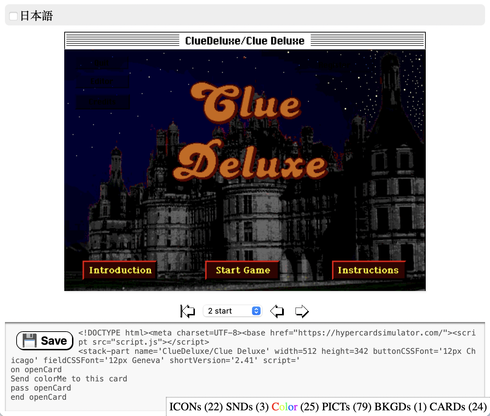

# hypercard-stack-uploader
Imports classic Hypercard stacks directly from archives and exports HTML that runs in the browser.

The importer will also import the stacks' resources, using but not including these libraries:

<a href="https://github.com/ParksProjets/Maconv">Maconv is a Linux software that can convert all kinds of old Macintosh formats, including MacBinary, Stuffit archives and HFS disk files.</a>

<a href="https://github.com/fuzziqersoftware/resource_dasm">resource_dasm is a disassembler for classic Mac OS resource forks.</a>

<a href="https://github.com/uliwitness/snd2wav">snd2wav by Uli Kusterer.</a>
 
LICENSE:
	This file was developed ©2022 Hypervariety Custom Software, LLC. There is no warranty of any kind expressed or implied.
	THIS FILE IS OPEN SOURCE. YOU CAN COPY AND RUN THIS FILE YOURSELF AND LEARN PROGRAMMING TECHNIQUES FROM IT.
	Although the code is not very well-written or pretty, in the interests of public discourse, I am making it available for view. 
	
	THANK YOU TO THE RETRO-HACKERS WHO FIGURED OUT THE HC STACK FORMAT.
